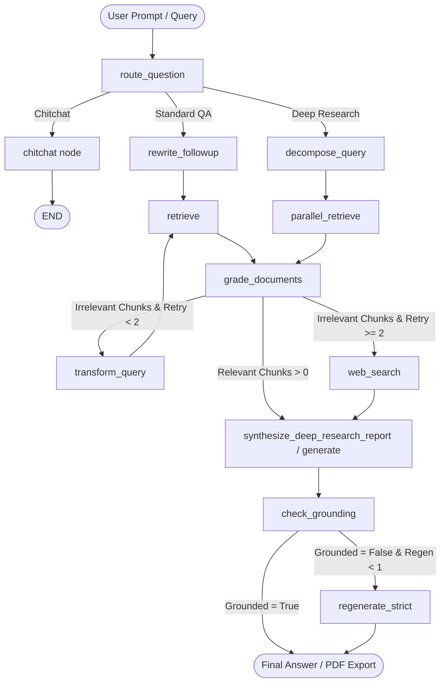

# 🔬 Production-Grade Agentic RAG Research Assistant

An enterprise-ready **Agentic RAG & Multi-Perspective Research Assistant** built with **LangChain**, **LangGraph**, **Google Gemini API**, **FAISS**, **BM25**, **Streamlit**, and **ReportLab**.

The system features an autonomous agent graph capable of query routing, multi-perspective sub-query decomposition, parallel dense + sparse hybrid retrieval, document relevance grading, web search fallbacks, strict grounding checks, and PDF/Markdown report generation.

---

## 🌟 Key Architectural Features

1. **Advanced Multi-Perspective Query Expansion**:
   - Decomposes broad research prompts into 3 targeted sub-queries:
     - **Technical Definition & Architecture**: Fundamental mechanisms and concepts.
     - **Comparative Analysis & Trade-offs**: Evaluation benchmarks, pros/cons, and alternatives.
     - **Future Implications & Strategic Outlook**: Emerging trends, security, and scalability.

2. **Parallel Hybrid Retrieval Aggregator**:
   - Executes multi-query retrieval concurrently across **FAISS (Dense vector embeddings)** and **BM25 (Sparse lexical keyword search)** using `ThreadPoolExecutor`.
   - Performs Reciprocal Rank Fusion (RRF) and Cross-Encoder reranking (`BAAI/bge-reranker-base`).
   - Filters near-duplicate document chunks across sub-queries using Jaccard word similarity thresholds (`0.85`).

3. **Deep Research Report Synthesis**:
   - Autonomous synthesis engine structuring publication-grade reports:
     - Executive Summary
     - Methodology & Retrieval Overview
     - Technical Architecture & Core Definitions
     - Comparative Findings & Trade-offs
     - Future Implications & Strategic Outlook
     - Annotated Bibliography & Source References

4. **Multi-Format Export Utilities (`utils/exporter.py`)**:
   - Direct export of synthesized research reports into downloadable **Markdown (`.md`)** or formatted **PDF (`.pdf`)** files built using ReportLab.

5. **Production Observability & Tracing (LangSmith)**:
   - Built-in tracing integration via `LANGCHAIN_TRACING_V2` to capture node execution latency, prompt chains, state mutations, and token consumption metrics.

6. **Circuit Breakers & Rate Limit Resilience**:
   - Graceful degradation for Tavily web search failures and LLM 429 rate limits using `tenacity` exponential backoff retries.

---

## 📐 System Architecture Diagram



---

## 🛠️ Project Structure

```text
.
├── app.py                  # Streamlit Multi-Document Ingestion & Deep Research UI
├── api.py                  # FastAPI server endpoints
├── Dockerfile              # Multi-stage Dockerfile (Python 3.13-slim)
├── docker-compose.yml      # Docker Compose configuration with volume persistence
├── requirements.txt        # Production dependencies
├── pytest.ini              # Pytest configuration with pythonpath
├── README.md               # Architecture documentation and manual
├── .env.example            # Environment variable template
├── data/
│   ├── raw/                # PDF upload directory
│   └── index/              # FAISS index and chunks.pkl storage
├── src/
│   ├── config.py           # Application settings and LangSmith tracing setup
│   ├── graph.py            # LangGraph state graph compilation & routing edges
│   ├── ingest.py           # PyPDF document loader & FAISS index generator
│   ├── llm.py              # LLM client factory (Google Gemini, OpenAI, Ollama)
│   ├── nodes.py            # Graph nodes & resilient LLM structured invokers
│   ├── prompts.py          # Structured prompt templates
│   ├── retrievers.py       # Parallel Hybrid Retriever with similarity deduplication
│   ├── schemas.py          # Pydantic structured output models
│   ├── service.py          # Agent execution service wrapper
│   └── state.py            # TypedDict LangGraph execution state
├── utils/
│   ├── __init__.py
│   └── exporter.py         # Markdown and ReportLab PDF export utilities
└── tests/
    └── test_e2e.py         # Comprehensive Pytest integration test suite
```

---

## ⚡ Quick Start & Setup Guide

### 1. Prerequisites
- Python 3.13+ installed
- Google Gemini API Key (or OpenAI / Ollama setup)

### 2. Environment Configuration
Copy `.env.example` to `.env` and populate your API credentials:

```bash
cp .env.example .env
```

```env
LLM_PROVIDER=google
LLM_MODEL=gemini-2.5-flash
GOOGLE_API_KEY=your_google_gemini_api_key_here
TAVILY_API_KEY=your_tavily_api_key_here

# LangSmith Observability Tracing
LANGCHAIN_TRACING_V2=true
LANGCHAIN_ENDPOINT=https://api.smith.langchain.com
LANGCHAIN_API_KEY=your_langsmith_api_key_here
LANGCHAIN_PROJECT=agentic-rag-research-assistant
```

### 3. Local Installation & Launch

```bash
# Create virtual environment
python -m venv venv

# Activate virtual environment
# Windows:
.\venv\Scripts\activate
# Linux/macOS:
source venv/bin/activate

# Install dependencies
pip install -r requirements.txt

# Launch Streamlit Application
streamlit run app.py
```

Access the Streamlit web interface at **`http://localhost:8501`**.

---

## 🧪 Running Integration Tests

Run the full end-to-end integration test suite with `pytest`:

```bash
python -m pytest tests/test_e2e.py -v
```

All 9 test cases cover graph routing, query decomposition, parallel retrieval, circuit breakers, rate limits, and PDF/Markdown exporter utilities.

---

## 🐳 Containerization & Production Packaging

### Option A: Running with Docker Compose (Recommended)

Build and deploy the application container with volume persistence for `./data`:

```bash
docker-compose up --build -d
```

Check container status and health:

```bash
docker-compose ps
```

Stop the service:

```bash
docker-compose down
```

### Option B: Building Docker Image Manually

```bash
# Build multi-stage image
docker build -t agentic-rag-assistant:latest .

# Run container
docker run -d \
  --name agentic_rag \
  -p 8501:8501 \
  --env-file .env \
  -v $(pwd)/data:/app/data \
  agentic-rag-assistant:latest
```

---

## 📄 License
Production-grade Agentic RAG Assistant codebase. Distributed for production usage and research extensions.
